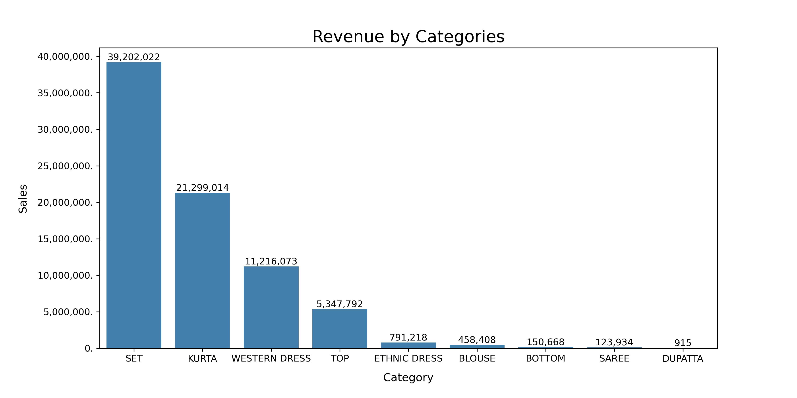
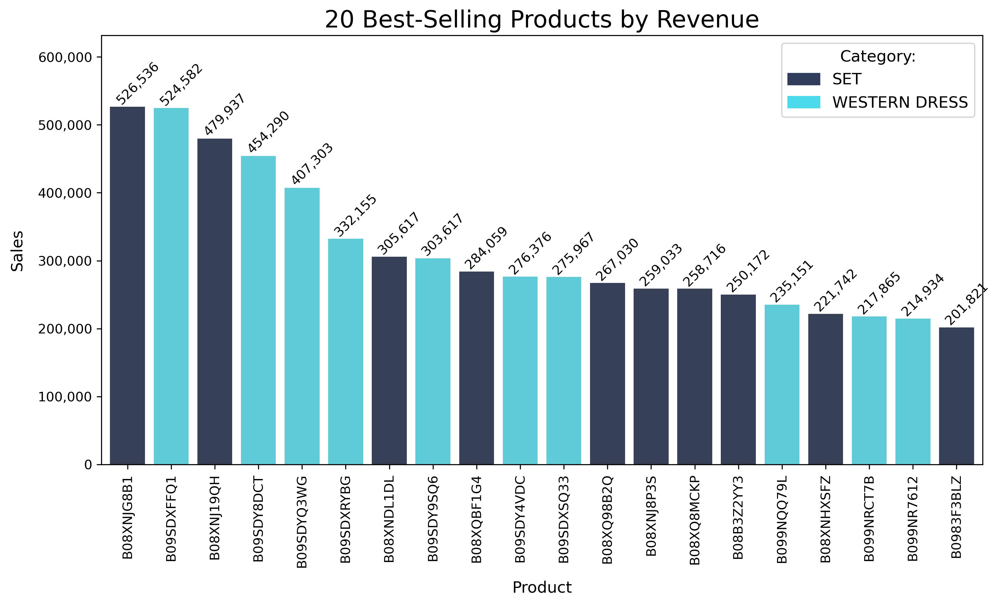
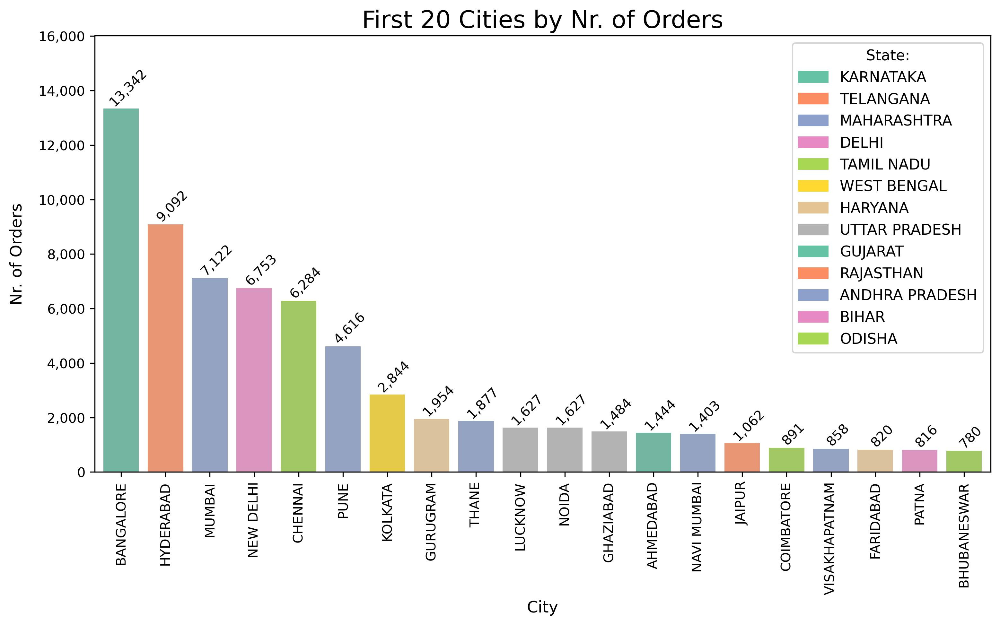
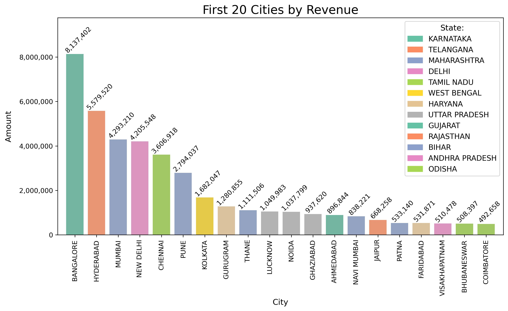
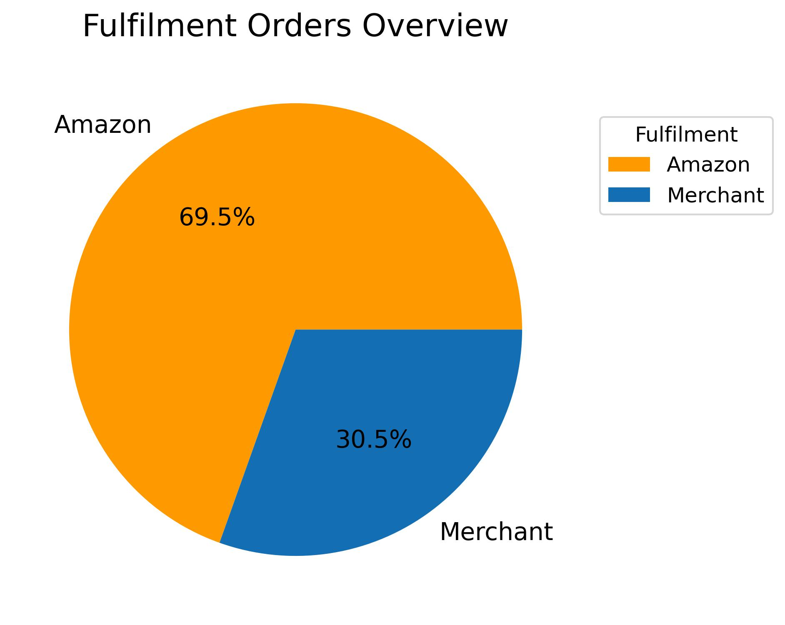
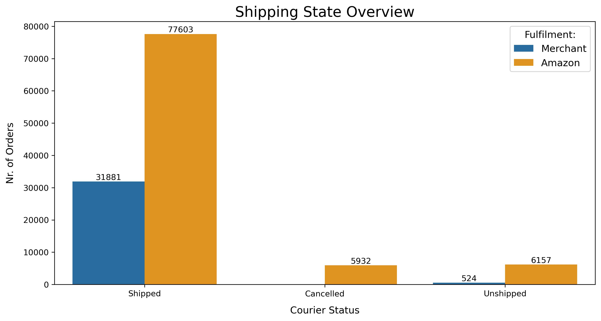

# Exploratory Data Analysis and Data Cleaning on a Amazon E-Commerce Dataset

This project is an exploratory data analysis and data cleaning of a dataset that contains detailed insights into Amazon sales data. The dataset covers a 90-day time frame, from 31 March 2022 to 29 June 2022, and includes information such as SKU Code, Design Number, Stock, Category, and Size. The goal of the project is to help optimize product profitability by answering several key questions related to the sales data.

## Scope of the project
The project aims to answer the following questions:

1. Which categories have sold the most?
2. What are the 20 best-selling products by quantity?
3. What are the 20 best-selling products by revenue?
4. What are the 20 cities that made the most orders?
5. What are the 20 cities that generate the most income?
6. How many orders are fulfilled by Amazon, and how many are fulfilled by the Merchant?

## Key findings
The analysis of the Amazon sales data yielded the following key findings:

1. The top three categories that sold the most were SET, KURTA, and WESTERN DRESS.
<figure>
    
</figure>

2. The codes of the 20 best-selling products by quantity were identified.
<figure>
    
</figure>

3. The codes of the 20 best-selling products by revenue were identified.
<figure>
    
</figure>

4. A ranking of the 20 cities with the most orders was created, and each region was assigned a color in the chart.
<figure>
    
</figure>

5. A ranking of the 20 cities that generated the most income was created.
<figure>
    
</figure>

6. The analysis revealed that 69.5% of the orders were fulfilled by Amazon, while 30.5% were fulfilled by the Merchant. The shipping state overview was also checked.
<figure>
    
</figure>

<figure>
    
</figure>

Overall, this exploratory data analysis and data cleaning project provides valuable insights into Amazon sales data and can help businesses optimize product profitability.

### Data Source
The data for this project can be found at [data.world](https://data.world/anilsharma87), thanks to [ANil](https://data.world/anilsharma87).

### Author 
[Barbara Callegari](https://numberslab.net)  
To learn more about the author visit my [LinkedIn Profile](https://www.linkedin.com/in/barbaracallegari)

### Licence
All rights reserved 2023. All code is **created and owned by Barbara Callegari**.   
**If you use his code, please give me a skill endorsement in Python and Data Analysis on LinkedIn**.   
Visit me at https://www.linkedin.com/in/barbaracallegari